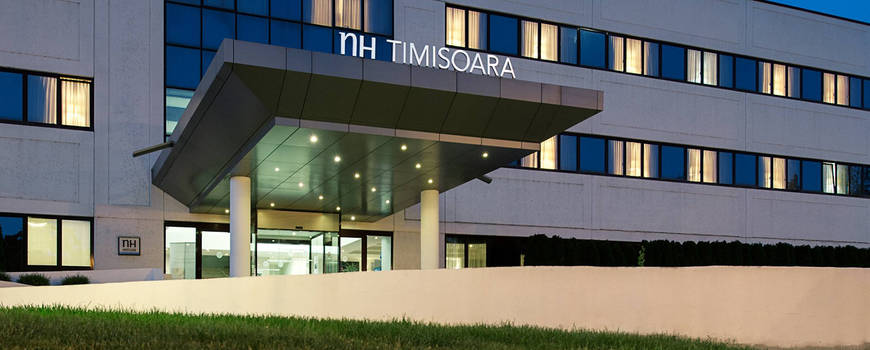

Hotel NH Timisoara enjoys a great location in a peaceful area opposite the People’s Park. The beautiful Bega river is right across the street, while the city center is only a 15-minute walk away.
* a short walk from the city’s business and cultural districts
* peaceful, pretty area near the university
* 15-minute walk from the center of town

The hotel has 83 guest-rooms, which are spacious, light and stylishly decorated in warm, natural colors. Rooms are equipped with desks and chairs for working, while Wi-Fi, satellite TV and air con all come as standard. And if you’re looking for extra space, we have 3 Junior Suites with separate sitting areas and great views.
* high-speed WiFi connection
* accessible rooms are available
* half of our rooms enjoy park views

We have a bright, spacious and modern bar-restaurant that serves both local and international dishes. After that, you can head to the gym to work off your meal. Or if you’d rather relax, you’re welcome to use our spa. It’s home to a Turkish bath, a sauna and a Jacuzzi.
* bikes available for rent
* beautiful summer terrace
* spa with gym, sauna and Turkish bath